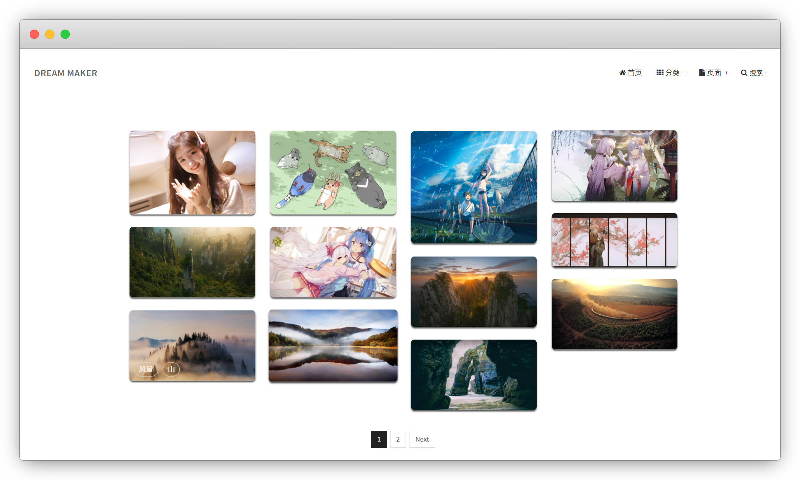

# typecho-theme-pic-r
typecho主题pic魔改，[示例页面](https://pir-vercel.vercel.app/) 

### 说明

- 主题似乎最开始移植自wordpress, ~~原作为 @[国服第一盖伦](https://p.liangxingjian.com)，遗憾的是其主页已无法访问~~ 原作为 [massive](https://themeforest.net/item/massive-responsive-multipurpose-html5-template/12503639)。

- 狗尾续貂随意改改，壁纸相册化，~~不支持显示博文~~

### 注意项

- 克隆项目后将主题文件夹上传至typecho目录 **/usr/themes/** 路径下，到后台选择启用；

- 修改后为完全壁纸或相册模板，~~不支持显示博文~~

- 新建文章并将图片插入正文即可，支持任意数量，暂不支持附件形式

- 主页图片标签跟随文章tag，如无tag则显示分类名称

- 每页显示图片数量取决于后台 **设置-> 阅读-> 每页文章数目** 以及正文中插入的图片数量

### Todo

- [x] 移除 二级页面
- [x] 改进 首页样式，添加 灯箱、标签等
- [x] 图片懒加载
